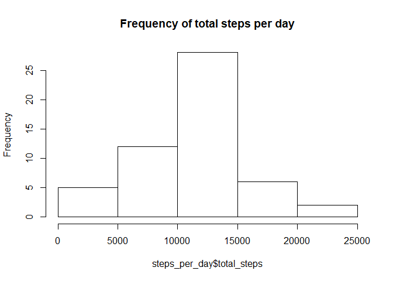
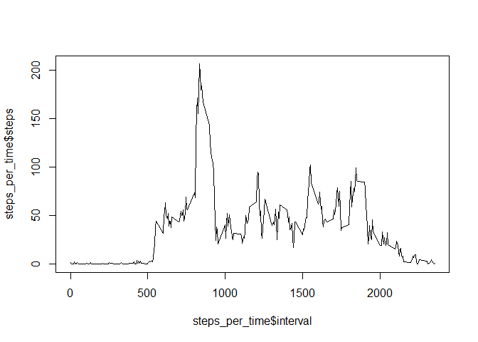
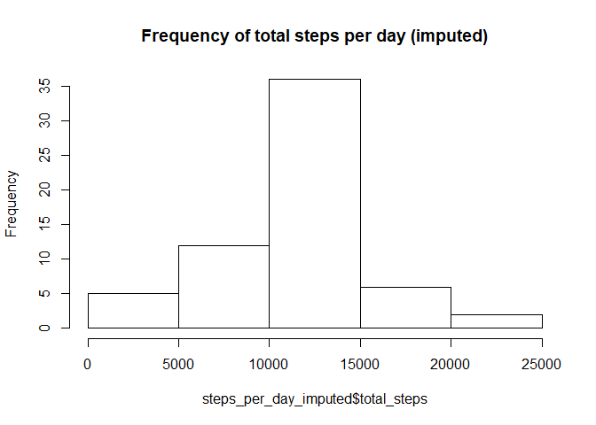
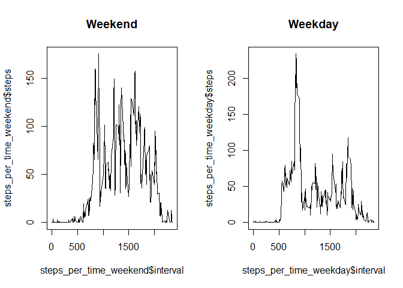

# Reproducible Research: Peer Assessment 1


#---
#title: "Reproducible Research - Assignment"
#author: "Daniel Jungen"
#date: "18 Oktober 2017"
#output: html_document
#---


# Activity Analysis with R

It's assumed that "activity.csv" is in your working directory.

## Loading and preprocessing data

The first step is to read that file into a data frame (activity) and omit the na-values (relevant_data):


```r
activity<-read.csv("activity.csv")
relevant_data<-na.omit(read.csv("activity.csv"))
```

## What is mean total number of steps taken per day?

First the number of steps per day is asked to determine:


```r
temp<-relevant_data[,1:2]
steps_per_day <-aggregate(temp$steps, by=list(date=temp$date), sum)
names(steps_per_day)<-c("date", "total_steps")
```

Next we plot a histogram of the total number of steps per day:


```r
hist(steps_per_day$total_steps, main= "Frequency of total steps per day")
```

<!-- -->

The mean and medium of total steps per day is also requested:


```r
mean_steps_per_day<-mean(steps_per_day$total_steps)
median_steps_per_day<-median(steps_per_day$total_steps)

mean_steps_per_day
```

```
## [1] 10766.19
```

```r
median_steps_per_day
```

```
## [1] 10765
```

## What is the average daily activity pattern?

Next we are interested in an activity plot throughout the day over the 5 minutes intervals:


```r
steps_per_time<-aggregate(relevant_data$steps, list(relevant_data$interval) , mean)
colnames(steps_per_time)<-c("interval", "steps")
plot(steps_per_time$interval, steps_per_time$steps, type="l")
```

<!-- -->

The highest activity can be found in the interval:


```r
#maximum activity
steps_per_time[which(steps_per_time$steps==max(steps_per_time$steps)),1]
```

```
## [1] 835
```

## Imputing missing values

The number of missing values can be determined as the difference between the dimension of th original data and the data without missing values:


```r
#Number of missing values
dim(activity)[1]-dim(relevant_data)[1]
```

```
## [1] 2304
```

```r
only_na<-activity[is.na(activity[,1]),]

#imputing with avg per interval

na_imputed<-merge(only_na, steps_per_time, by="interval")

na_imputed<-na_imputed[,c(1,3,4)]
colnames(na_imputed)<-c("interval", "date", "steps")

relevant_data_imputed<-rbind(na.omit(activity), na_imputed)


temp<-relevant_data_imputed[,1:2]
steps_per_day_imputed <-aggregate(temp$steps, by=list(date=temp$date), sum)
names(steps_per_day_imputed)<-c("date", "total_steps")

hist(steps_per_day_imputed$total_steps, main= "Frequency of total steps per day (imputed)")
```

<!-- -->

The mean and medium of total steps per day (imputed) is also requested:


```r
mean_steps_per_day_imputed<-mean(steps_per_day_imputed$total_steps)
median_steps_per_day_imputed<-median(steps_per_day_imputed$total_steps)

mean_steps_per_day_imputed
```

```
## [1] 10766.19
```

```r
median_steps_per_day_imputed
```

```
## [1] 10766.19
```

The difference between the imputed and non imputed median and mean are:


```r
mean_steps_per_day_imputed-mean_steps_per_day
```

```
## [1] 0
```

```r
median_steps_per_day_imputed-median_steps_per_day
```

```
## [1] 1.188679
```

Imputing the dataframe with the average number of steps doesn't seem to have a big impact on the mean and median.

##Are there differences in activity patterns between weekdays and weekends?


```r
#distinguishing between weekend and weekday:

weekend<-c("Samstag", "Sonntag")

weekendday<-data.frame(as.character(weekdays(as.Date(as.character(relevant_data$date))) %in% weekend))
names(weekendday)<-c("Weekday")

relevant_data[,4]<-weekendday
colnames(relevant_data)<-c("steps", "date", "interval", "weekend")

relevant_data_weekend<-subset(relevant_data, relevant_data$weekend == TRUE)
relevant_data_weekday<-subset(relevant_data, relevant_data$weekend == FALSE)

steps_per_time_weekend<-aggregate(relevant_data_weekend$steps, list(relevant_data_weekend$interval) , mean)
colnames(steps_per_time_weekend)<-c("interval", "steps")

steps_per_time_weekday<-aggregate(relevant_data_weekday$steps, list(relevant_data_weekday$interval) , mean)
colnames(steps_per_time_weekday)<-c("interval", "steps")


par(mfrow=c(1,2))

plot(steps_per_time_weekend$interval, steps_per_time_weekend$steps, type="l", main = "Weekend")
plot(steps_per_time_weekday$interval, steps_per_time_weekday$steps, type="l", main = "Weekday")
```

<!-- -->

